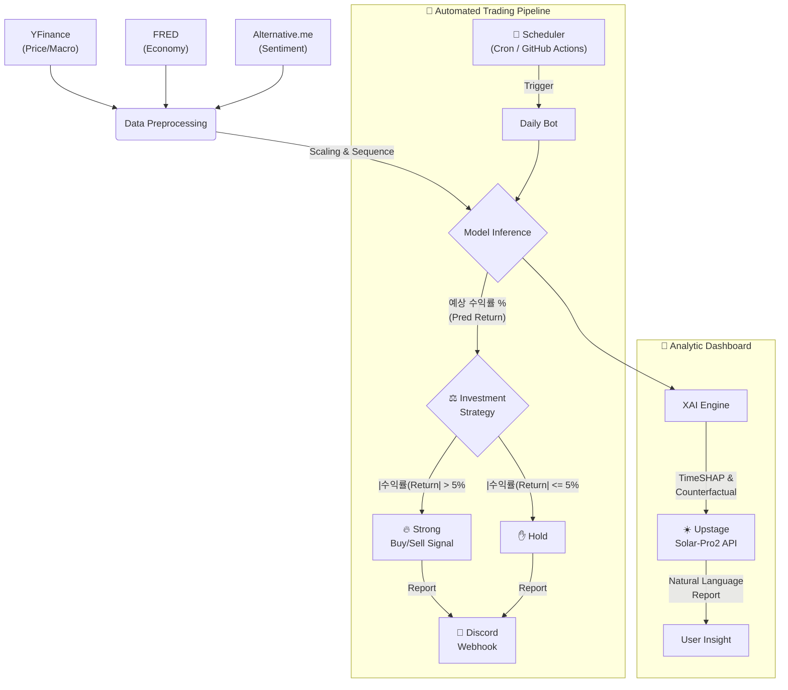

# 🪙 TOBIT: AI-Driven Bitcoin Investment Analysis Platform


> **ToBigs Conference TOBIT Project**
>
> "단순한 예측(Forecast)을 넘어, 설명(Explain)하고 시뮬레이션(Simulate)합니다."

**TOBIT**은 다양한 시계열 모델(PatchTST, iTransformer 등)과 **XAI(Explainable AI)** 파이프라인을 결합한 비트코인 분석 플랫폼입니다.

단순히 미래 가격을 예측하는 것을 넘어, **TimeSHAP**, **Counterfactual Simulator**를 통해 예측의 근거를 설명하고 **LLM**을 통해 복잡한 분석 결과를 알기 쉽게 해석합니다. 특히, **임계값(Threshold) 기반 투자 전략**을 적용하여 노이즈를 필터링하고 확실한 수익 기회에만 매매 시그널을 생성합니다.

---

## 📑 Contents
1. [Preview](#-preview)
2. [Key Points](#-key-points)
3. [System Architecture](#-system-architecture)
4. [Dashboard Manual](#%EF%B8%8F-dashboard-manual)
5. [Data & Models](#-data--models)
6. [Installation & Usage](#-installation--usage)
7. [Project Structure](#-project-structure)
8. [Limitations & Improvements](#-limitations--future-improvements)
---

## 📺 Preview

| **1. Market Forecast** | **2. Model Architecture & Specs** |
|:---:|:---:|
|  |   |
| 실시간 가격 예측 및 경제 지표 대시보드 | 6가지 시계열 모델 구조 시각화 및 파라미터 명세 |

| **3. Deep Insight (XAI - LLM)** | **4. Deep Insight (XAI - Detail)** |
|:---:|:---:|
|  |    |
| Solar-Pro2 LLM 기반 자연어 투자 리포트 | Pruning(좌), Global(중), Cell-level(우) 다각도 분석 |

| **5. Discord Notification** | **6. Strategy Backtest** |
|:---:|:---:|
|  |   |
| 매일 아침 전송되는 투자 전략 알림 | **깊은 하락장 직전 매도(Cash Out)를 통한 수익률 방어 성공** |

---

## 💡 Key Points

### 1. XAI (Explainable AI) & LLM Insight
TOBIT은 단순한 예측 결과를 넘어, XAI 기법과 LLM을 통해 직관적인 투자 인사이트를 제공합니다.

* **TimeSHAP:** "모델이 **왜** 그런 예측을 했는가?"를 다각도로 분석합니다.
    * **Local Analysis (개별 예측 설명):**
        * **Feature-Level:** 거래량, 금리, 심리지수 중 어떤 **변수**가 이번 예측을 주도했는지 파악합니다.
        * **Event-Level:** 과거 14~45일(Lookback Window) 중 결정적이었던 **특정 시점**을 포착합니다.
        * **Cell-Level:** 특정 시점의 특정 변수(예: *3일 전의 거래량 급증*)가 미친 영향을 정밀 분석합니다.
    * **Global Analysis (전체 모델 설명):**
        * 전체 데이터셋에 걸쳐 모델이 어떤 **Feature**와 **Event** 패턴을 중요하게 학습했는지 경향성을 시각화합니다.
    * **Pruning:** 예측에 불필요한 노이즈 데이터를 가지치기(Pruning)하여 핵심 정보만 보여줍니다.

* **Counterfactual Simulator (What-If Analysis):** "만약 **변수**가 달라진다면 결과는?"
    * *"만약 오늘의 비트코인 거래량이 20% 급증한다면, 7일 뒤 가격은 어떻게 될까?"*
    * 특정 변수(Feature)의 수치를 조작하여 모델의 민감도(Sensitivity)를 실시간으로 테스트합니다.

* **LLM Analyst (Easy-to-Understand):** "그래서 이게 무슨 뜻인가?"
    * 복잡한 **TimeSHAP 히트맵**과 **시뮬레이션 결과**를 **LLM(Solar-Pro2)**이 종합적으로 분석합니다.
    * 전문 용어 대신 누구나 이해하기 쉬운 자연어로 복잡한 분석 결과를 알기 쉽게 해석합니다.

### 2. Time-Series Forecasting Models
* **Transformer-based:** **PatchTST**, **iTransformer** (장기 시계열 및 다변량 상관관계 학습 최적화)
* **NN-based:** **DLinear** (추세/계절성 분해), **TCN** (Dilated Conv), **LSTM**, **MLP**

### 3. Strategic Investment & Automation
단순 예측값이 아닌, 실전 투자에 적합한 전략을 자동화했습니다.
* **Threshold-based Strategy (임계값 전략):** 예측된 **수익률(Return)**이 설정된 임계값(Threshold, 예: ±5%)을 초과할 때만 `BUY/SELL` 시그널을 생성합니다. 이를 통해 잦은 매매로 인한 손실(수수료 과대)을 방지합니다. (7일 예측 수익률 평균 vs 현재 실제값)
* **Daily Discord Bot:** 매일 아침 9시, 최신 데이터를 수집하고 추론(Inference)을 수행하여 전략 리포트를 디스코드로 발송합니다.
* **Backtesting:** 과거 데이터를 기반으로 해당 전략의 누적 수익률을 시뮬레이션하고 검증할 수 있습니다.

---

## 🛠 System Architecture

데이터 파이프라인은 다양한 **외부 API**를 통해 데이터를 수집하며, **자동화된 투자 봇**과 **분석용 대시보드**로 나뉩니다.



---

## 🕹️ Dashboard Manual

TOBIT 대시보드(`app.py`)는 4가지 핵심 탭으로 구성되어 있습니다.

### 1. 📊 Market Forecast
* **기능:** 선택한 모델(PatchTST, DLinear 등)이 예측한 **향후 7일간의 비트코인 가격**을 시각화합니다.
* **활용:** 과거 데이터(회색)와 예측 데이터(초록/빨강)를 연결하여 추세를 한눈에 파악하고, 일자별 예상 등락폭을 확인합니다.

### 2. 🧠 Deep Insight (XAI)
* **TimeSHAP Analysis:** 모델이 현재 예측을 내리기 위해 **과거의 어떤 시점(Event)**과 **어떤 변수(Feature)**를 중요하게 봤는지 히트맵으로 분석합니다. (Pruning 기능 포함)
* **Counterfactual Simulator:** *"거래량이 30% 늘어난다면?"*과 같은 가정을 설정하여, 미래 가격이 어떻게 변하는지 실시간으로 시뮬레이션(What-If)합니다.
* **LLM Analyst:** 복잡한 그래프를 **Solar-Pro2 LLM**이 분석하여, 전문 애널리스트 스타일의 자연어 리포트로 요약해줍니다.

### 3. 📘 Model Specs
* **기능:** 프로젝트에 사용된 6가지 시계열 모델(MLP, LSTM, TCN, DLinear, PatchTST, iTransformer)의 **아키텍처 다이어그램**과 핵심 하이퍼파라미터를 설명합니다.

### 4. ⚡ Strategy Backtest
* **기능:** 사용자가 설정한 **초기 자본금($)**과 **목표 수익률(Threshold %)**을 기반으로 과거 데이터를 시뮬레이션합니다.
* **활용:** AI 모델을 따랐을 때의 수익률과 단순 보유(Buy & Hold) 전략의 수익률을 비교하여 전략의 유효성을 검증합니다.

---

## 📊 Data & Models

### Data Sources & APIs
본 프로젝트는 다양한 외부 API를 활용하여 시장의 맥락(Context)을 통합적으로 분석합니다.

| API / Source | Data Type | Description |
|---|---|---|
| **Yahoo Finance API** | `Crypto` & `Macro` | 비트코인(BTC), 이더리움(ETH), 미국 국채금리(10Y), 달러인덱스(DXY), 금, 나스닥 등 |
| **FRED API** | `Economy` | 미국 소비자물가지수(CPI), 통화량(M2) 등 거시 경제 지표 |
| **Alternative.me API** | `Sentiment` | Crypto Fear & Greed Index (공포 탐욕 지수) |
| **Upstage API** | `LLM` | **Solar-Pro2** 모델을 활용한 XAI 결과 자연어 해석 및 리포트 생성 |
| **Discord Webhook** | `Notification` | 실시간 매매 시그널 및 데일리 리포트 전송 |

### Supported Models
* **Transformer-based:** **PatchTST**, **iTransformer** (장기 시계열 및 다변량 상관관계 학습 최적화)
* **NN-based:** **DLinear** (추세/계절성 분해), **TCN** (Dilated Conv), **LSTM**, **MLP**
* **Multi-Horizon:** 단기(14일), 중기(21일), 장기(45일) Lookback Window에 대해 각각 학습된 가중치를 사용합니다.

---

## 📦 Installation & Usage

### 1. Clone & Environment Setup
Python 3.9 환경에서 최적화되어 있습니다.
```bash
git clone [https://github.com/your-username/tobit.git](https://github.com/your-username/tobit.git)
cd tobit

# Conda 사용 시
conda env create -f environment.yml
conda activate btc-env

# Pip 사용 시
pip install -r requirements.txt
```

### 2. Configuration
API 키 설정을 위해 `.streamlit/secrets.toml` 파일을 생성하거나 환경변수를 설정해주세요.
```toml
# .streamlit/secrets.toml
FRED_API_KEY = "your_fred_api_key"          # 경제 지표 수집용 (Optional)
DISCORD_WEBHOOK_URL = "your_webhook_url"    # 알림 봇용 (Optional)
UPSTAGE_API_KEY = "your_llm_api_key"        # AI 분석 코멘트용 (Optional)
```

### 3. Train Models (Optional)
이미 학습된 가중치(`weights/`)가 포함되어 있지만, 새로운 데이터로 학습하려면 아래 명령어를 실행하세요.
```bash
# 14, 21, 45일 윈도우에 대해 6개 모델 순차 학습
python train.py
```

### 4. Run Dashboard
예측 및 XAI 분석(TimeSHAP, Counterfactual), 백테스팅 결과 등을 웹 인터페이스로 확인합니다.
```bash
streamlit run app.py
```

### 5. Run Daily Bot
매일 아침 9시, 시장을 분석하고 디스코드 알림을 전송합니다. (Cronjob/Github Actions 권장)
```bash
python daily_bot.py
```

---

## 📂 Project Structure

```bash
tobit/
├── assets/               # Demo Images & Logo
├── data/                 # Cached Market Data (CSV)
├── weights/              # Trained Model Weights (.pth)
├── app.py                # Main Dashboard (Forecast + XAI Engines)
├── daily_bot.py          # Automated Inference & Discord Bot
├── data_utils.py         # Data Pipeline (YFinance, FRED, Fear&Greed)
├── model.py              # PyTorch Model Architectures (PatchTST, iTransformer, etc.)
├── train.py              # Multi-Horizon Training Script
├── test_api.py           # API Connectivity Test
└── environment.yml       # Dependency Config
```

---

## 💭 Limitations & Future Improvements

**1. Data Diversity for Volatility (데이터 다양성)**
* **한계:** 비트코인은 변동성이 매우 크기 때문에, 현재의 가격 및 거시경제 지표(Macro)만으로는 시장의 급격한 심리 변화를 즉각 반영하기 어렵습니다.
* **개선:** 실시간 뉴스 기사, 소셜 미디어 등의 비정형 데이터를 모델 입력(Input)으로 추가하고, 최신 뉴스 감성 분석(Sentiment Analysis)을 결합하여 예측의 정교함을 높이는 방안을 고려할 수 있습니다.

**2. Model & Horizon Expansion (모델 및 예측 기간 확장)**
* **한계:** 현재는 LTSF(Long-Term Time Series Forecasting) 특화 모델들을 단기(7일) 예측에 주로 활용하고 있습니다.
* **개선:**
    * **Mamba** 등 최신 시계열 예측 모델을 도입하여 실험 범위를 확장할 수 있습니다.
    * 단기 예측(Short-term) 전용 모델과 더 긴 시점(Long-term)을 예측하는 모델을 구분하여 포트폴리오를 다각화하는 방향이 필요합니다.

**3. Fully Automated Execution (완전 자동 매매)**
* **한계:** 현재 시스템은 매수/매도 시그널을 알림으로 보내주는 단계까지만 수행하며, 실제 주문은 사용자가 직접 해야 합니다.
* **개선:** **Upbit**나 Binance 같은 거래소 API를 연동하여, 시그널 발생 시 실제로 매매가 체결되는 **완전 자동화된 트레이딩 봇(Auto-Trading Bot)**으로 고도화가 가능합니다.

**4. Advanced Trading Strategies (전문 트레이딩 전략 고도화)**
* **한계:** 현재는 예측 수익률이 일정 수준을 넘는지 판단하는 단순한 임계값(Threshold) 전략을 사용하고 있습니다.
* **개선:** 이동평균 교차(MA Crossover), 볼린저 밴드, RSI 등 다양한 기술적 지표를 결합하거나, 변동성 돌파와 같은 **전문적인 퀀트 트레이딩 전략**을 도입하여 수익 안정성을 높일 수 있습니다.

## ⚠️ Notice
이 프로젝트는 데이터 분석 연구 및 학습 목적으로 개발되었습니다. **제공되는 모든 예측 및 시뮬레이션 결과는 실제 투자를 권유하는 것이 아니며, 투자에 대한 모든 책임은 사용자에게 있습니다.**

---

**Developed by jeongmin Ha**
*ToBigs Conference 2026*
